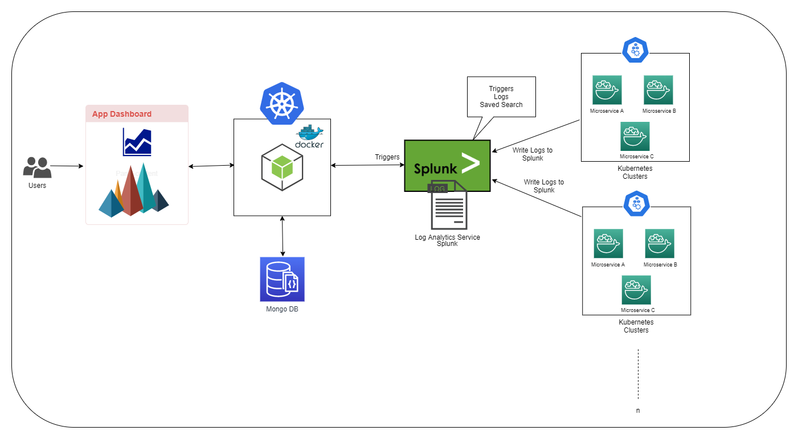

# Applications Health Analysis. 

## Abstract:
All Major Enterprise Applications comprises of different set of inter dependent micro services, and there will be many inter dependent micro services and their API’s which will be failing due to many issues. And debugging and troubleshooting the issues will be very difficult during deployment and production phases where it is difficult to track the failures among the comprising API’s.  
Applications Health Analysis will give the detailed report of the API’s which are failing frequently and the dependent API’s which are getting effected by the failed API’s. This lets the organizations monitor their deployments at a Microservice and API level where they get to see the live status of how their applications are performing. This will ease the process of identify the issues mainly in the production environments where a single failure of an API will cause a feature to break. We can also track the modules of the product which are failing frequently and take necessary actions on it and testing them thoroughly before releasing them.
 

### Technology Stack:
**Front-End** :  React JS , Bootstrap  
**Backend:** NodeJs, Express JS  
**Database**: MongoDB  
**Log Analysis**: Splunk  
**Cloud**: AWS, IBM Kubernetes Cluster  

# Architecture

